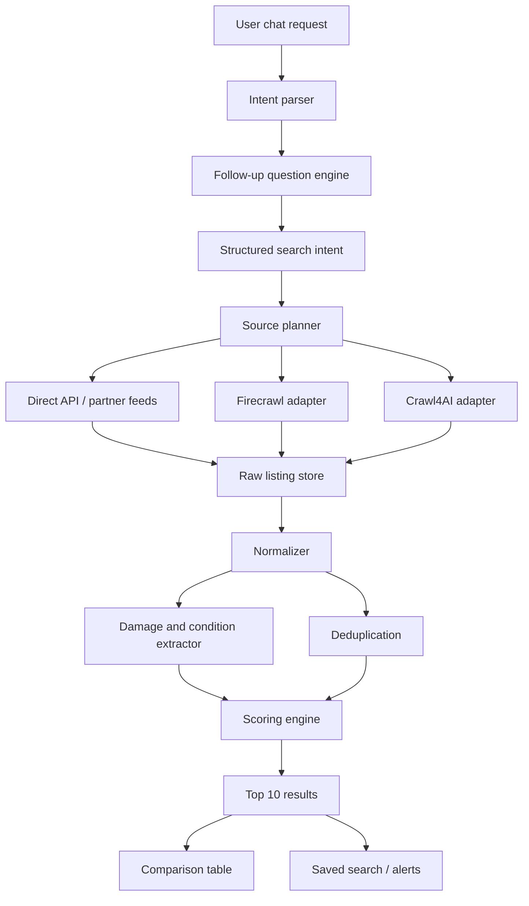

# Crawl4AI v0.9.2 vs Firecrawl - Research and Recommendation for the Used-Car AI Search App

Date: 2026-08-19

## Executive Recommendation

Use a hybrid strategy:

1. **Use Firecrawl first for MVP discovery, prototyping, and difficult JavaScript-heavy listing pages.**
2. **Use Crawl4AI as the long-term in-house ingestion engine for source-specific marketplace adapters once the target websites and schemas stabilize.**
3. **Do not rely on either tool as the only data strategy.** The production plan should still prioritize direct marketplace APIs, licensed data providers, dealer feeds, and partnerships before crawling.

For the app we planned, the best architecture is:

- **Chat intake:** your own backend + LLM.
- **Source planner:** decides which marketplaces to query.
- **Fetch layer:** Firecrawl for fast/managed crawling during MVP; Crawl4AI for controlled, self-hosted adapters.
- **Normalizer:** your own code.
- **AI extraction:** schema-based extraction for condition/damage/warranty/specs.
- **Ranking:** your own scoring engine.
- **Storage:** your own database, not crawler storage.

Short version:

> Firecrawl helps you move faster. Crawl4AI gives you more control. The app needs both speed now and control later.

## What I Read and Followed

The user asked to research:

- Crawl4AI release `v0.9.2`: https://github.com/unclecode/crawl4ai/releases/tag/v0.9.2
- Firecrawl agent onboarding skill: https://www.firecrawl.dev/agent-onboarding/SKILL.md

I fetched and read Firecrawl's onboarding `SKILL.md`. Its relevant instruction for this app is **Path B: Integrate Firecrawl Into an App**, because the goal is not a one-time scrape; the goal is product code that will call Firecrawl repeatedly from the app backend. The skill says the core routing question is:

> What should Firecrawl do in the product?

For this application, the answer is:

- Use `/search` when the app needs to discover relevant listing/search pages.
- Use `/scrape` with JSON schema when the app already has a specific listing URL.
- Use `/crawl` or `/map` carefully when the app needs to discover multiple pages under a known source path.
- Use `/interact` only when a listing/search page requires clicks, forms, filter changes, pagination, or other browser actions.
- Use `/monitor` later for saved searches and price-drop/change detection.

I did **not** install Firecrawl because this is a research/comparison task, not an implementation task, and no Firecrawl API key was provided.

## Crawl4AI v0.9.2 Research

### Release-Specific Findings

Crawl4AI `v0.9.2` was released in July 2026. The GitHub release page and release note identify it as a maintenance patch, not a feature release.

Important points:

- No new features.
- No breaking changes.
- Fixes a streaming crawl cleanup/resource leak in `MemoryAdaptiveDispatcher`.
- Fixes Docker Playground advanced config returning 400.
- Fixes Docker Monitor WebSocket auth returning 500.
- Includes Playwright headless shell in the Docker image.
- Fixes GPU Docker builds using `ENABLE_GPU=true`.
- Adds regression tests for dispatcher stream-close cleanup.

Why this matters for our app:

- The dispatcher cleanup fix matters if we run long or cancelable multi-listing jobs, because old crawl tasks should not keep running after a stream is closed.
- The Playwright Docker packaging fix matters if we deploy Crawl4AI workers in containers.
- The release does not change extraction capabilities; those come from the broader Crawl4AI 0.9.x stack.

### Crawl4AI Broader 0.9.x Capabilities

Crawl4AI is an open-source LLM-friendly crawler/scraper. Its docs emphasize:

- Clean Markdown generation.
- Structured extraction using CSS, XPath, or LLM strategies.
- Advanced browser control.
- Hooks, proxies, stealth modes, and session reuse.
- Parallel crawling and real-time use cases.
- No forced API keys or paywalls.

Core developer interface:

- Python-first.
- `AsyncWebCrawler`.
- `BrowserConfig`.
- `CrawlerRunConfig`.
- Markdown generation with optional content filters.
- CSS/XPath extraction for repeated listing structures.
- LLM extraction for messy or irregular pages.
- Docker deployment option.

### Crawl4AI Strengths for the Car App

Crawl4AI is strong when we want:

- Full control of crawling behavior.
- Source-specific adapters for each marketplace.
- Lower marginal cost at scale.
- Custom proxy/session/browser configuration.
- Local or private deployment.
- Repeatable CSS/XPath extraction for listing cards and detail pages.
- A controlled pipeline where raw HTML, screenshots, extracted JSON, and logs are stored in our own infrastructure.

It fits especially well for:

- DubiCars adapter.
- YallaMotor adapter.
- OpenSooq adapter.
- Haraj adapter, if we build Arabic-aware parsing and source-specific logic.
- Scheduled ingestion jobs.
- Large-scale nightly refreshes.

### Crawl4AI Weaknesses for the Car App

Crawl4AI requires us to own more of the hard parts:

- Proxy management.
- Anti-bot handling.
- Browser worker infrastructure.
- Retry logic.
- Job queues.
- Rate limiting per domain.
- Deployment and monitoring.
- Site-specific selector maintenance.
- Compliance review per source.

It also does not give us a managed web search API by default. If the app needs to discover pages from a natural-language query, we need another search provider or custom search strategy.

## Firecrawl Research

### Firecrawl Onboarding Findings

Firecrawl's onboarding skill divides usage into three segments:

- **CLI skills:** live web work during an agent session.
- **Build skills:** integrating Firecrawl into product code.
- **Workflow skills:** repeatable deliverables like research briefs, lead lists, QA reports, etc.

For this app, the correct path is **Build skills / app integration**, because the crawler will run inside the product backend.

The onboarding skill also says Firecrawl can be used without installing anything through the REST API at:

- `POST /search`
- `POST /scrape`
- `POST /interact`
- `POST /parse`
- `POST /monitor`
- Other research/debug endpoints

Keyless use exists as a fallback, but full app usage should use a Firecrawl API key.

### Firecrawl API Capabilities Relevant to the App

Firecrawl provides:

- `/search` for live web discovery.
- `/scrape` for one known URL.
- `/scrape` with JSON format for schema-based structured extraction.
- `/crawl` for bulk extraction from a site/path.
- `/map` for URL discovery.
- `/interact` for browser actions.
- `/monitor` for recurring change checks.
- SDKs and REST API.
- Hosted browser/rendering infrastructure.
- Proxy handling.
- Markdown, HTML, raw HTML, links, screenshots, JSON, summaries, and other output formats.

For a listing page, the useful pattern is:

```json
{
  "url": "https://example-marketplace.com/listing/123",
  "formats": [
    "markdown",
    {
      "type": "json",
      "schema": {
        "type": "object",
        "properties": {
          "make": { "type": "string" },
          "model": { "type": "string" },
          "year": { "type": "integer" },
          "price": { "type": "number" },
          "currency": { "type": "string" },
          "mileage_km": { "type": "number" },
          "color": { "type": "string" },
          "regional_specs": { "type": "string" },
          "accident_claim": { "type": "string" },
          "damage_signals": {
            "type": "array",
            "items": { "type": "string" }
          }
        }
      }
    }
  ],
  "onlyMainContent": true,
  "proxy": "auto"
}
```

### Firecrawl Strengths for the Car App

Firecrawl is strong when we want:

- Fast MVP.
- Less crawler infrastructure.
- Managed browser rendering.
- Managed proxy modes.
- Clean Markdown quickly.
- Built-in schema-based JSON extraction.
- A search endpoint to discover pages.
- Browser interaction when a page needs clicks or forms.
- Monitoring later for price-drop alerts.

It fits especially well for:

- Prototype search over a few sources.
- Testing which websites are technically scrapeable.
- Extracting from individual listing URLs.
- Crawling small known sections.
- Handling JS-rendered marketplace pages without building browser infra first.
- Saved search or price-monitoring features.

### Firecrawl Weaknesses for the Car App

Firecrawl has tradeoffs:

- API-credit cost can rise quickly at car-listing scale.
- JSON extraction costs more than simple page scraping.
- Enhanced proxy or interaction modes cost more.
- Vendor dependency.
- Less low-level control than running our own browser workers.
- Hosted data processing may create privacy/compliance questions depending on the listing data and jurisdictions.
- Keyless tier is not appropriate for production.
- Full-site crawling can be too broad for marketplace inventory; we still need source-specific query planning and strict scope.

## Direct Comparison

| Area | Crawl4AI v0.9.x / v0.9.2 | Firecrawl | Winner for This App |
|---|---|---|---|
| MVP speed | Requires setup, code, infra | Very fast API-first start | Firecrawl |
| Long-term cost at scale | Lower marginal cost if self-hosted | Credit-based recurring cost | Crawl4AI |
| Infrastructure burden | We own it | Firecrawl owns much of it | Firecrawl |
| Control | Very high | Medium/high, but bounded by API | Crawl4AI |
| Search/discovery | Not a hosted search API | Built-in `/search` | Firecrawl |
| Single listing extraction | Good with CSS/LLM strategies | Excellent with `/scrape` JSON mode | Tie |
| Repeated marketplace adapters | Excellent once selectors are stable | Good but can be costly | Crawl4AI |
| Dynamic JavaScript pages | Supported via browser | Supported via hosted browser | Firecrawl early, Crawl4AI later |
| Browser interactions | Possible but we build flow | `/interact` is productized | Firecrawl |
| Proxies/anti-bot | We manage | Managed proxy options | Firecrawl |
| Compliance control | Strong if self-hosted | Depends on Firecrawl settings/plan | Crawl4AI |
| Data retention control | We control storage | Need Firecrawl settings/plan for strict needs | Crawl4AI |
| Monitoring price changes | Build it ourselves | `/monitor` exists | Firecrawl for MVP |
| Open source | Yes | Yes, but cloud has extra features | Crawl4AI for self-host purity |
| Vendor lock-in | Low | Medium | Crawl4AI |
| Team complexity | Higher | Lower | Firecrawl |

## Fit by Product Feature

### 1. Chat Intake

Use neither as the main chat brain.

The chat flow should be built in our app:

- Extract make/model/year/budget/location/color/specs/mileage/condition.
- Ask follow-up questions.
- Decide when enough information exists.
- Produce a structured search intent.

Crawler tools should only run after the search intent is ready.

### 2. Finding Relevant Listing Pages

Best option:

- Use known marketplace search URLs and adapters.

Firecrawl role:

- Use `/search` when we do not know where relevant pages are.
- Use `/map` or `/crawl` for controlled source discovery.

Crawl4AI role:

- Use custom search-page adapters once we know marketplace URL structures.

Recommendation:

- MVP: Firecrawl `/search` and `/scrape` for quick experiments.
- Production: source-specific adapters using Crawl4AI or direct APIs.

### 3. Extracting Listing Details

Best option:

- Use deterministic extraction first, AI extraction second.

Crawl4AI role:

- CSS/XPath extraction for stable marketplace structures.
- LLM extraction for descriptions and condition signals.

Firecrawl role:

- `/scrape` JSON mode for rapid schema extraction from individual listing pages.

Recommendation:

- MVP: Firecrawl JSON mode to learn the field patterns quickly.
- Production: Crawl4AI CSS/XPath for core fields, LLM for messy text.

### 4. Damage, Accident, Warranty, and Risk Signals

Neither tool should be trusted alone to decide if a car is clean.

Use them to extract claims, not verify truth.

Output should say:

- "Listing claims accident-free."
- "Damage not mentioned."
- "Inspection report available."
- "Imported specs; verify accident history."
- "Condition unknown."

Recommendation:

- Use LLM extraction with evidence snippets.
- Store confidence and source text.
- Never convert missing data into "clean".

### 5. Ranking Top 10 Cars

Use neither crawler for ranking.

Ranking should be your own scoring engine:

- User-intent fit.
- Price vs comparable market.
- Mileage.
- Specs.
- Condition/risk.
- Warranty.
- Seller/source trust.
- Freshness.
- Location.

Firecrawl/Crawl4AI only provide the raw and extracted listing data.

### 6. Saved Searches and Price Drops

Firecrawl role:

- `/monitor` can help prototype recurring checks.

Crawl4AI role:

- Build own scheduled jobs and price history once scaling.

Recommendation:

- MVP: Firecrawl monitor for known URLs or source pages.
- Production: own scheduler plus normalized price observations table.

## Recommended Technical Strategy

### Phase 1: MVP Validation

Use Firecrawl for speed.

Build:

- Chat intake.
- Structured vehicle intent.
- Firecrawl source probes.
- Firecrawl `/scrape` JSON extraction for listing detail pages.
- Simple source adapters for 2-3 UAE websites.
- Top 10 ranking and comparison table.

Why:

- We can validate product value before investing heavily in crawling infrastructure.
- Firecrawl helps reveal which sites are easy/hard.
- Faster to produce demos.

### Phase 2: Adapter Stabilization

Introduce Crawl4AI.

Build:

- Crawl4AI workers.
- Per-source adapters.
- CSS/XPath extraction for listing cards and detail pages.
- LLM extraction only for condition text.
- Raw HTML snapshots.
- Parser tests.
- Deduplication.
- Price history.

Why:

- Once source structures are known, deterministic extraction is cheaper and more controllable.
- Long-term unit economics are better.

### Phase 3: Production Scale

Use a mixed fetch strategy:

- Direct APIs/feeds where possible.
- Crawl4AI for stable high-volume sources.
- Firecrawl for difficult pages, ad hoc discovery, monitors, and emergency fallback.

Why:

- No single crawler will be perfect across GCC/MENA marketplaces.
- Different sources will need different tactics.

## Suggested Architecture



## Source-Specific Recommendation

### DubiCars

Use:

- Firecrawl during MVP for fast listing/detail extraction tests.
- Crawl4AI later if pages are stable and allowed.
- Prefer API/provider/partnership if available.

### YallaMotor

Use:

- Firecrawl `/scrape` or `/search` for initial testing.
- Crawl4AI once URL patterns and selectors are known.

### CarSwitch / CARS24

Use:

- Firecrawl initially because these may have richer JavaScript flows.
- Capture inspection/warranty fields carefully.
- Prefer partnership/API because trust/inspection data is core value.

### OpenSooq / Haraj

Use:

- Crawl4AI plus Arabic-aware parsing for long-term extraction.
- Firecrawl for quick tests and difficult pages.
- Strong deduplication and seller-quality logic required.

## Cost and Scale Considerations

Firecrawl pricing is credit-based. Current public pricing shows:

- Free: 1,000 credits/month, 2 concurrent requests.
- Hobby: 5,000 pages.
- Standard: 100,000 pages, 50 concurrent requests.
- Growth: 500,000 pages, 100 concurrent requests.
- Scale: 1,000,000 credits/month, 150 concurrent requests.

Public credit table:

- Scrape: 1 credit/page.
- Crawl: 1 credit/page.
- Map: 1 credit/page.
- Search: 2 credits/10 results.
- Interact: 2 credits/browser minute.
- Monitor: 1 credit/page/check.
- Agent: preview, dynamic pricing.

Implication for the app:

- Firecrawl is affordable for MVP and beta.
- Firecrawl can become expensive if every user search triggers hundreds of listing-detail JSON extractions.
- Crawl4AI becomes attractive once we have stable recurring ingestion jobs and enough volume.

## Compliance and Operational Notes

Important:

- Neither Firecrawl nor Crawl4AI gives permission to reuse another marketplace's listings.
- We still need source-by-source legal review.
- Check Terms of Use and `robots.txt`.
- Do not bypass login walls, CAPTCHAs, or access controls.
- Use rate limits and caching.
- Store crawl timestamp and original source URL.
- Link users back to original listings.
- Remove inactive/sold listings promptly.
- Avoid unnecessary seller personal data.

Firecrawl states that users are responsible for respecting site policies and that it respects robots directives by default. Crawl4AI gives us more self-hosting control, but also more responsibility.

## Final Decision Matrix

### Choose Firecrawl if:

- We need a demo quickly.
- We need to scrape JavaScript-heavy pages without setting up browser infrastructure.
- We want a hosted API.
- We need search/discovery.
- We need browser interaction.
- We are validating source feasibility.
- We want saved-search monitoring quickly.

### Choose Crawl4AI if:

- We need lower long-term crawl cost.
- We need full control.
- We want self-hosting.
- We are building stable adapters per marketplace.
- We need custom sessions/proxies/hooks.
- We want to store and audit every raw crawl artifact ourselves.
- We are running scheduled high-volume ingestion.

### Best answer for this application:

Use **Firecrawl for the first working version** and **Crawl4AI for the production ingestion backbone**.

## Concrete Implementation Plan

### Week 1

- Build Firecrawl proof-of-concept for 2 sources.
- Test 20 listing URLs from each source.
- Extract fields with JSON schema:
  - make
  - model
  - year
  - price
  - mileage
  - color
  - specs
  - warranty
  - accident/damage claims
  - source URL
- Record success/failure rate.

### Week 2

- Build chat intake.
- Connect structured search intent to source planner.
- Use Firecrawl for live fetches.
- Store raw Markdown and JSON in database.
- Return top 10 matches.

### Weeks 3-4

- Add Crawl4AI worker.
- Rebuild the easiest source adapter with Crawl4AI.
- Compare extraction accuracy and cost against Firecrawl.
- Keep Firecrawl as fallback for failures.

### Weeks 5-6

- Add deduplication.
- Add price observations.
- Add parser test fixtures.
- Decide source-by-source:
  - direct API/feed
  - Firecrawl
  - Crawl4AI
  - manual/user-pasted URL only

## Sources

- Crawl4AI v0.9.2 GitHub release: https://github.com/unclecode/crawl4ai/releases/tag/v0.9.2
- Crawl4AI v0.9.2 release note: https://github.com/unclecode/crawl4ai/blob/main/docs/blog/release-v0.9.2.md
- Crawl4AI docs home: https://docs.crawl4ai.com/
- Crawl4AI quickstart: https://docs.crawl4ai.com/core/quickstart/
- Crawl4AI LLM extraction strategies: https://docs.crawl4ai.com/extraction/llm-strategies/
- Firecrawl onboarding skill: https://www.firecrawl.dev/agent-onboarding/SKILL.md
- Firecrawl Build with AI docs: https://docs.firecrawl.dev/ai-onboarding
- Firecrawl scrape API docs: https://docs.firecrawl.dev/api-reference/endpoint/scrape
- Firecrawl data extractor guide: https://docs.firecrawl.dev/developer-guides/usage-guides/choosing-the-data-extractor
- Firecrawl crawl product page: https://www.firecrawl.dev/crawl
- Firecrawl search product page: https://www.firecrawl.dev/search
- Firecrawl pricing: https://www.firecrawl.dev/pricing
- Firecrawl GitHub README: https://github.com/firecrawl/firecrawl/blob/main/README.md
