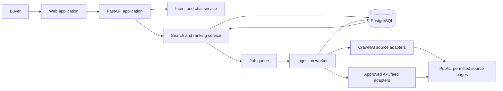

# Carveo Buyer Search Refactor - Implementation Plan

Date: 2026-08-19

## 1. Purpose and Approval Boundary

This document turns `PLAN.MD`, `CRAWL4AI_FIRECRAWL_COMPARISON.MD`, and the current codebase into an implementation sequence for review before coding begins.

Carveo will change from a seller-side Streamlit form that extracts one vehicle description and emails it to a buyer-side used-car search assistant. A buyer will describe the vehicle they want in chat, answer only the missing questions, receive normalized listings from approved sources, and compare the ten best matches before visiting the original listing.

This plan authorizes design, scaffolding, fixtures, and tests after approval. It does not authorize live crawling of a source until that source has passed the compliance gate in Phase 0.

## 2. Evidence From the Existing Repository

| Area | Current implementation | Change required |
|---|---|---|
| Product flow | `frontend/app.py` requires an uploaded image, seller description, verified Gmail account, then sends a listing by email. | Replace with buyer chat, search state, results, filters, and source links. |
| Application service | `backend/car_service.py` sanitizes text, calls Azure OpenAI, validates listing fields, and invokes a placeholder image classifier. | Retire the seller submission service; retain and narrow reusable input-safety concepts for chat and source content. |
| AI prompt | `backend/prompts.py` extracts seller attributes such as tires, windows, notices, and price. | Add structured schemas/prompts for buyer intent and condition-signal extraction. Do not use an LLM for deterministic filtering, normalization, or arithmetic. |
| Configuration | `backend/config.py` uses dataclass singletons and placeholder Azure credentials. | Move to environment-backed settings with separate API, worker, database, and source configuration. |
| Delivery | `backend/email_service.py` sends Gmail email with image/JSON attachments. | Remove from runtime MVP scope; preserve only if a later saved-search/email-alert feature needs a redesigned notification service. |
| UI helpers | `frontend/components.py` is a Streamlit component collection with inline HTML/CSS. | Replace with purpose-built web UI components; do not carry forward unsafe raw HTML rendering. |
| Dependencies/tests | No database, queue, crawler, API layer, or tests are present. | Introduce a typed API, persistence, asynchronous worker, repeatable fixtures, and focused test layers. |

Specific code risks to resolve during the refactor:

- `CarTypeClassifier.detect_body_type()` is a placeholder, so image analysis is not a usable product capability.
- `CarFeatureExtractor.extract_features()` returns success-shaped fallback values on model failure. New services must return typed failure states and preserve the failure reason.
- The current regex blocklist treats useful user language such as `password` as invalid. Replace broad blocking with length limits, structured prompts, output validation, and explicit treatment of crawled listing text as untrusted data.
- Gmail credentials are entered into the Streamlit session. The buyer-search MVP must have no credential entry surface in the browser.
- The README and UI describe a different product. They must be rewritten once the first working buyer flow lands.

## 3. Target Architecture

The target is a modular monolith with a separate worker process. This is intentionally smaller than a distributed microservice system but keeps the ingestion boundary explicit.



### 3.1 Chosen stack

- API: FastAPI, Pydantic v2, SQLAlchemy 2, Alembic.
- Web client: React, TypeScript, Vite, TanStack Query, and a small accessible component layer.
- Persistence: PostgreSQL for durable entities and searches; Redis for queueing, rate-limit state, short-lived chat state, and cache keys.
- Background work: Dramatiq or Celery, selected during Phase 1 after a short proof of worker ergonomics. Default recommendation: Dramatiq with Redis because the initial job topology is simple.
- Crawling: a private Python worker image containing Crawl4AI and Playwright/Chromium. Direct APIs, feeds, and partnerships remain first preference.
- Object storage: S3-compatible storage for permitted raw snapshots/screenshots only when necessary for parser debugging and audit retention.
- AI: retain Azure OpenAI behind a small provider interface; use strict Pydantic structured output and audit/evaluation fixtures.

### 3.2 Why Crawl4AI is a worker library, not a public service

Crawl4AI provides `AsyncWebCrawler`, `BrowserConfig`, `CrawlerRunConfig`, Markdown conversion, and CSS/XPath or LLM extraction strategies. Its default cache behavior bypasses cache, so Carveo must set and own explicit cache policy. [Crawl4AI quickstart](https://github.com/unclecode/crawl4ai/blob/main/docs/md_v2/core/quickstart.md)

The Crawl4AI Docker HTTP server is useful for local diagnostics, but version 0.9.0 made it secure-by-default: it requires authentication by default and rejects request-supplied browser-control fields such as headers, cookies, proxies, hooks, and arbitrary JavaScript. [Crawl4AI 0.9.0 release notes](https://github.com/unclecode/crawl4ai/blob/main/docs/blog/release-v0.9.0.md)

Therefore production ingestion will:

1. Run a private `worker` container with the Crawl4AI Python package installed.
2. Keep each source's selectors, allowed domains, navigation steps, timeout, concurrency, and cache policy in versioned source-profile code.
3. Reuse a single `AsyncWebCrawler` process/browser pool per job batch; use bounded `arun_many()` concurrency only within a source's approved limit.
4. Use CSS/XPath or embedded structured data first. Use LLM extraction only for fields that cannot be recovered deterministically and label those fields with confidence/provenance.
5. Persist raw fetch metadata and normalized records, never browser cookies or source credentials unless a written partnership requires them.
6. Keep the Crawl4AI HTTP server loopback-only if it is run locally for the playground/dashboard; it is not part of the public product path.

The official Docker guide lists Docker, 4 GB RAM, and Python 3.10+ as baseline expectations and documents a current stable 0.9.2 release. The image tag and digest will be pinned in the implementation lockfile after a staging smoke test, rather than using `latest`. [Crawl4AI Docker guide](https://github.com/unclecode/crawl4ai/blob/main/deploy/docker/README.md)

## 4. Product Scope

### MVP included

- UAE only.
- English first, with data models and UI copy designed to add Arabic later.
- Conversational search intake and refinement.
- Search readiness rule: market, make, year/range, model/body type or broad-search consent, budget or budget-free consent, and two preference signals.
- Listings from fixture data plus one approved source adapter or licensed feed.
- Top-ten results, comparison table, transparent filters, fit score, confidence, risks, source attribution, and outbound listing links.
- Deterministic normalization, deduplication, ranking, and basic price-quality estimate.
- Observability, source health reporting, audit fields, and parser/ranking tests.

### Explicitly deferred

- Live UAE-wide crawling before source approval.
- Saudi Arabia, Qatar, and all cross-market currency comparison.
- Login, payment, financing, lead routing, VIN decoding, or seller communications.
- CV/image body-type classification.
- Price-drop notifications and saved searches.
- Full mobile native applications.

## 5. Canonical Data Contracts

Pydantic models are the contract between chat, adapters, persistence, ranking, and UI. No layer should pass unvalidated dictionaries as a business entity.

### 5.1 Buyer intent

`SearchIntent` fields:

- `market`, `city`, `radius_km`
- `make`, `models`, `body_types`, `year_min`, `year_max`
- `budget_min`, `budget_max`, `currency`
- `mileage_max_km`, `colors`, `specifications`, `seller_types`
- `must_have`, `nice_to_have`, `exclude_terms`
- `condition_preferences` such as accident-free, warranty, service history, inspection
- `confidence`, `unknown_required_fields`, `broad_search_permissions`

### 5.2 Source and normalized listing

`RawListing` stores source id, canonical URL, retrieved time, source payload/hash, HTTP/fetch status, parser version, and expiry/removal state.

`VehicleListing` stores source identity, title, source URL, price/currency, country/city, seller type, make/model/trim, year, mileage, specifications, warranty/service/inspection fields, photo count, condition signals, extracted evidence snippets, field-level confidence, first/last seen, and parser version.

`ListingRiskSignal` has `kind`, `severity`, `confidence`, `evidence`, and `origin` (`source_structured`, `deterministic_text`, or `llm_text`). Values include accident, repaint, damage, flood, odometer concern, imported-specs, missing-service-history, and ambiguous-price.

`RankedMatch` adds hard-filter result, component scores, overall score, deal-quality label, reasons, warnings, dedupe/canonical vehicle id, and rank.

### 5.3 Database migrations

Create these tables through Alembic, with indexes on source URL hash, market/make/model/year, last seen time, canonical vehicle id, and price observations:

- `sources`
- `source_profiles`
- `crawl_runs`
- `raw_listings`
- `vehicle_listings`
- `canonical_vehicles`
- `listing_risk_signals`
- `price_observations`
- `search_sessions`
- `search_messages`
- `search_intents`
- `match_results`

Raw snapshots use a short documented retention period. Personal data such as seller phone numbers is discarded unless a later legal review says otherwise.

## 6. Repository Refactor Map

```text
Carveo/
  apps/
    api/
      app/
        api/routes/
        core/
        db/
        domain/
        services/
        repositories/
        schemas/
      tests/
    web/
      src/features/chat/
      src/features/search/
      src/features/results/
      src/lib/api/
  workers/
    ingestion/
      adapters/
      crawl4ai/
      pipelines/
      tests/fixtures/
  packages/
    contracts/
      carveo_contracts/
  infra/
    docker/
    compose/
  docs/
    sources/
    adr/
  IMPLEMENTATION_PLAN.MD
```

Changes to existing files:

- Replace `frontend/app.py` and `frontend/components.py` after the new web app is live; do not mix the old seller form into the buyer experience.
- Split `backend/car_service.py` into reusable `input_safety` code and new domain services. Delete the seller-specific orchestration only after migration checks pass.
- Replace `backend/prompts.py` with versioned prompt templates and Pydantic schemas for intent extraction and condition extraction.
- Replace `backend/config.py` singleton settings with environment-backed API/worker settings. Secrets remain in environment variables or a secret manager, never source code.
- Remove `backend/email_service.py` from active dependencies. Do not delete it until an approved migration removes the seller flow and README references.
- Replace `requirements.txt` with separately pinned API, worker, and web dependency manifests; a lockfile is mandatory.
- Rewrite `README.md` to document buyer search locally only after the first vertical slice works.

## 7. Source Access and Crawl4AI Plan

### 7.1 Compliance gate per source

Each source must have a `docs/sources/<source>.md` record with owner, market, terms/robots review date, permitted endpoint/page classes, data allowed to store, attribution requirements, rate/concurrency ceiling, retention period, failure/opt-out contact route, and approval status.

An adapter cannot be enabled in production until its record is marked `approved`. This will be enforced by `SourceProfile.enabled_for_environment` and an environment allowlist.

### 7.2 Adapter interface

Each adapter implements:

```python
class ListingSourceAdapter(Protocol):
    source_id: str

    async def discover(self, query: SourceQuery) -> list[ListingReference]: ...
    async def fetch(self, references: list[ListingReference]) -> list[RawListing]: ...
    def normalize(self, raw: RawListing) -> list[VehicleListing]: ...
```

`discover` and `fetch` must be independent so URL discovery can be cached, retried, and scheduled differently from detail-page refreshes.

### 7.3 Crawl4AI implementation sequence

1. Add `crawl4ai` and Playwright to the worker image only; run `crawl4ai-doctor` and a permitted staging target during container build/CI smoke verification.
2. Create `CrawlProfile` with allowed domains, selectors, wait conditions, max pages, timeout, cache TTL, concurrency, and allowed navigation actions.
3. Build `Crawl4AIClient` around a shared `AsyncWebCrawler`, `BrowserConfig`, and `CrawlerRunConfig`.
4. Use `JsonCssExtractionStrategy` or JSON-LD parsing before LLM extraction. The normalized parser owns validation and unit conversion.
5. Add a token-bucket limiter keyed by source, exponential backoff, jitter, retry classifications, idempotency keys, and a circuit breaker for repeated blocks/errors.
6. Store `crawl_run` metrics: attempts, success count, block count, latency, changed-content count, parsed-record count, parser version, and error category.
7. Add a source-level kill switch; it must stop future jobs without a deployment.
8. Run a scheduled refresh only for listings already discovered and within each source's permitted policy. Search-time refresh is optional and must not bypass the queue or rate limit.

### 7.4 Firecrawl role

Keep a `FetchProvider` abstraction. Firecrawl may be used in an isolated proof of concept for source discovery or difficult JavaScript pages only after legal approval and budget review. It will not alter the normalized listing contract or ranking pipeline. This preserves the hybrid direction in `CRAWL4AI_FIRECRAWL_COMPARISON.MD` without creating a vendor dependency in the core product.

## 8. Search, AI, and Ranking

### 8.1 Conversational intake

The chat orchestration is deterministic around a structured `SearchIntent`:

1. Validate the message length and encode it as untrusted data in a prompt boundary.
2. Extract candidate intent with structured output.
3. Merge only changed, validated fields into prior intent.
4. Compute the next missing high-value question from a fixed policy.
5. Start a search once the readiness rule is satisfied, or record broad-search permissions.
6. Show the interpreted search and let the buyer refine it without restarting the session.

The LLM cannot select sources, generate URLs, override filters, or calculate scores.

### 8.2 Normalization

Normalize make/model aliases, trim spelling, year/mileage/price types, currencies, city aliases, GCC/US/Japan specs labels, seller type, and condition vocabulary. Preserve the original source text alongside normalized values.

### 8.3 Dedupe

First use exact source URL and source listing ID. Then create a weighted candidate score using normalized make/model/year, price band, mileage band, location, photo hash where permitted, seller/dealer name, VIN only if legally collected, and title/text similarity. Ambiguous cases remain separate and are marked for review; no automatic merge across a threshold gap.

### 8.4 Ranking

Apply hard filters first. Score the survivors with explainable components:

- intent fit: 30
- price quality: 25
- condition and risk: 20
- trust/source quality: 10
- freshness: 5
- location: 5
- field confidence: 5

Every result response returns its component scores, match reasons, and warnings. The initial fair-price baseline is a robust median by make/model/year/market with minimum sample requirements; it should return `insufficient data` rather than inventing a valuation.

## 9. Implementation Phases

### Phase 0 - Product, access, and technical decisions

Deliverables:

- Approve this document and record architecture decisions in `docs/adr/`.
- Create source compliance records; choose one UAE source/feed for the vertical slice.
- Confirm Azure OpenAI deployment availability, database hosting, Redis, and object-storage policy.
- Define source labels, condition taxonomy, retention windows, and Arabic roadmap.

Acceptance criteria:

- One approved data source or licensed fixture dataset exists.
- A written source stop/kill-switch procedure is approved.
- No production worker is permitted to contact an unapproved host.

### Phase 1 - Foundation and contracts

Deliverables:

- Scaffold FastAPI, React, worker, compose configuration, `.env.example`, linting, formatting, type checks, and CI.
- Create Pydantic contracts, SQLAlchemy models, Alembic initial migration, and repository interfaces.
- Add health/readiness endpoints and structured JSON logging with request/crawl correlation ids.
- Add checked-in anonymized fixture records and test factories.

Acceptance criteria:

- `docker compose up` starts API, web, PostgreSQL, Redis, and an idle worker locally.
- Migration applies to an empty database.
- API contract, migration, and smoke tests run in CI.

### Phase 2 - Chat intake vertical slice

Deliverables:

- Implement sessions, messages, `SearchIntent`, readiness policy, prompt versioning, and structured LLM adapter.
- Build the chat screen with explicit interpreted requirements and editable filters.
- Add a fixture source that returns normalized UAE listings.

Acceptance criteria:

- The Mercedes example in `PLAN.MD` reaches search readiness in no more than the defined useful follow-up questions.
- Malformed LLM output, timeout, and partial intent cases return a useful typed response.
- Prompt-injection test corpus cannot change system policy or return secrets.

### Phase 3 - Results, ranking, and comparison

Deliverables:

- Implement hard filtering, score breakdown, deal-quality baseline, explanations, and comparison API.
- Build result list, sort/refine controls, warnings, source attribution, and original-listing actions.
- Add dedupe v1 with transparent cluster identity.

Acceptance criteria:

- Results contain at most ten ranked canonical matches and preserve the source URL.
- A comparison table displays price, mileage, specs, condition/risk, warranty, seller type, source, and location.
- Ranking fixture tests prove budget/condition/spec constraints behave as expected.

### Phase 4 - Crawl4AI approved-source adapter

Deliverables:

- Build the private Crawl4AI worker image and a single approved source adapter.
- Implement source profile, limiter, cache, retry, parser versioning, raw record capture, and kill switch.
- Add source health dashboard/API and a parser fixture suite based on saved permitted pages.

Acceptance criteria:

- The worker never exceeds the configured concurrency and request rate.
- Blocked, invalid, removed, and changed pages are classified and do not crash a batch.
- Re-running an unchanged job is idempotent and records a new observation only when appropriate.
- Disabling the source prevents new Crawl4AI calls immediately.

### Phase 5 - Condition intelligence, quality, and operations

Deliverables:

- Add deterministic and LLM-assisted risk-signal extraction with evidence and confidence.
- Add price observations, freshness states, stale/removal reconciliation, and evaluator datasets.
- Add metrics, dashboards, alerts, error tracing, backup/restore rehearsal, and load tests.

Acceptance criteria:

- Every risk signal in user-visible output has a source excerpt or structured origin.
- Price/deal labels use adequate sample thresholds and decline to score sparse segments.
- Parser accuracy, chat completion, ranking quality, source health, and latency are visible in telemetry.

### Phase 6 - Controlled market expansion

Deliverables:

- Add Saudi and Qatar only through the same source-approval, adapter, fixture, and evaluation gates.
- Add currency conversion with timestamp/provenance if cross-market comparison is enabled.
- Add Arabic localization after the English workflow achieves agreed quality targets.

Acceptance criteria:

- New sources do not change existing source contracts or ranking behavior unexpectedly.
- Market-specific requirements and source availability are visible to the buyer.

## 10. Test Plan

| Layer | Coverage |
|---|---|
| Unit | Intent merge/readiness, normalizers, currency/unit conversion, condition taxonomy, dedupe thresholds, ranking components, fair-price fallback. |
| Parser | Saved approved HTML/JSON fixtures for every source profile; required-field completeness, selector drift detection, and parser-version regression tests. |
| API | Session lifecycle, chat turns, validation, results/refinement, comparison, source-disabled behavior, authorization when introduced. |
| Worker | Rate limits, backoff, cancellation, idempotency, cache hit/miss, partial batch failure, kill switch, and removal reconciliation. |
| AI evaluation | Curated Gulf-English prompts, Arabic-ready mixed-language samples, ambiguous-model cases, refusal/broad-search cases, and adversarial injection corpus. |
| End-to-end | Fixture-only buyer search from first chat turn to comparison table; separate opt-in staging test for an approved source. |

## 11. Observability and Success Metrics

Track: search-ready conversion, time to first results, chat turns before search, source coverage, source success/block/error rate, parser completeness, duplicate-cluster rate, ranking clicks/outbound clicks, result freshness, price-label sample sufficiency, and user refinement rate.

Alert on a source's parsing completeness drop, block-rate spike, repeated browser crashes, queue age growth, failed migrations, or a sudden increase in LLM extraction failures.

## 12. Risks and Mitigations

| Risk | Mitigation |
|---|---|
| Source terms or robots disallow access | API/feed/partner-first policy, source register, disabled-by-default adapters, and URL-paste fallback. |
| Crawl4AI/browser resource usage | Dedicated worker image, bounded concurrency, browser reuse, memory limits, health checks, and fixture tests before scale. |
| Selector drift or anti-bot blocks | Parser versions, saved fixtures, source metrics, circuit breaker, kill switch, and no CAPTCHA/access-control bypass. |
| Inaccurate condition claims | Evidence snippets, field confidence, conservative warnings, no unsupported "verified" label. |
| LLM inconsistency or prompt injection | Structured outputs, validations, bounded context, fixed orchestration, evaluator corpus, and no model authority over data access/ranking. |
| Premature platform complexity | Modular monolith/API plus one worker; add services only when load or ownership requires them. |
| Sensitive listing data | Minimize collection, short raw retention, no seller contact capture by default, audit every external source. |

## 13. Review Decisions Needed Before Phase 1

1. Confirm UAE is the first market and select the first approved feed/source.
2. Approve FastAPI + React + PostgreSQL + Redis as the target stack, replacing the Streamlit seller form rather than extending it.
3. Confirm the MVP can launch with fixtures plus one source/feed, with source adapters disabled until compliance approval.
4. Confirm Azure OpenAI remains the preferred model provider for the first release.
5. Set the raw-page retention period and whether the MVP needs any user account or saved-search capability.

## 14. Definition of Done for the First Release

The first release is complete when a UAE buyer can open Carveo, express a vehicle request, receive focused follow-ups, search an approved dataset/source, view ten or fewer deduplicated and explainably ranked listings, compare them, see condition/freshness/source caveats, and open the original listing. The system must operate within configured source limits, expose source health, pass the fixture and ranking test suites, and retain enough provenance to explain every displayed fact.

## 15. Research References

- [Existing product execution plan](PLAN.MD)
- [Existing Crawl4AI and Firecrawl comparison](CRAWL4AI_FIRECRAWL_COMPARISON.MD)
- [Crawl4AI quickstart and async SDK](https://github.com/unclecode/crawl4ai/blob/main/docs/md_v2/core/quickstart.md)
- [Crawl4AI Docker deployment guide](https://github.com/unclecode/crawl4ai/blob/main/deploy/docker/README.md)
- [Crawl4AI 0.9.0 secure-by-default Docker-server release](https://github.com/unclecode/crawl4ai/blob/main/docs/blog/release-v0.9.0.md)
